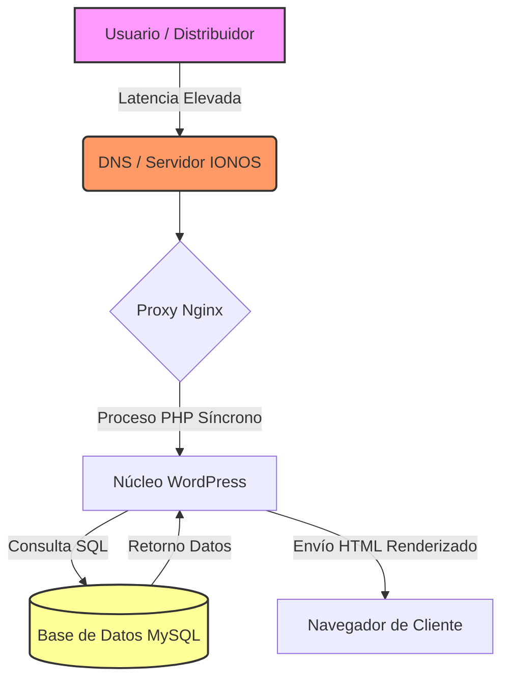

# INFORME DE AUDITORÍA DIGITAL Y ESTRATEGIA M&A (FUSIONES Y ADQUISICIONES)
**Cliente:** Hermanos Pintor, S.A. (hnospintor.es / hnospintor.com)  
**Fecha:** 9 de junio de 2026  
**Auditor:** Consultor Principal de Tecnología y M&A, LUZE Media Marketing  
**Alcance:** Auditoría Técnica, Cumplimiento Legal (RGPD/LSSI-CE), Optimización de la Venta a Profesionales y Posicionamiento de Marca

---

## Resumen Ejecutivo
Hermanos Pintor, S.A. es una consolidada empresa familiar de elaboración de patatas fritas tradicionales y aperitivos, fundada en 1968 en Campo de Criptana (Ciudad Real). Ante un potencial proceso de adquisición o venta de la compañía, su infraestructura digital representa un factor crítico de valoración. 

Esta auditoría determina que, aunque el valor de la marca fuera de la red y su cadena de distribución tradicional son excelentes, su ecosistema web actual—basado en hosting compartido monolítico y con carencias en el cumplimiento normativo—genera un descuento en la valoración total de la empresa (*Enterprise Value*). 

La transición hacia una arquitectura distribuida en el *Edge* (Cloudflare Pages) y la digitalización de la venta a profesionales (canal HORECA y grandes distribuidores) protegerán la valoración de la compañía frente a las auditorías técnicas del comprador y habilitarán un nuevo motor de ingresos corporativos.

---

## Pilar 1: Auditoría Técnica y Preparación para el Edge (Edge Readiness)

### Análisis del Ecosistema de Alojamiento Actual
*   **IP de Servidor Primaria:** `5.250.188.61` (Ubicada en la infraestructura de **IONOS SE** / 1&1).
*   **Servidor Web:** Nginx actuando como proxy inverso.
*   **Sistema de Control / OS:** Plesk sobre Linux (`X-Powered-By: PleskLin`).
*   **Gestor de Contenidos (CMS):** WordPress (`X-Powered-By: PHP/8.3.31`).
*   **Acceso API:** Endpoints de la API REST de WordPress activos (`/wp-json/wp/v2/pages/35`).

### Limitaciones Técnicas y Deuda Tecnológica
1.  **Vulnerabilidad ante Picos de Demanda:** WordPress sobre un servidor VPS básico de IONOS carece de alta disponibilidad. Durante negociaciones de adquisición o campañas publicitarias nacionales, un incremento del tráfico bloquearía la base de datos MySQL, devolviendo errores de tipo `502 Bad Gateway`.
2.  **Latencia de Carga (TTFB elevado):** Dado que cada petición del usuario requiere la ejecución de código PHP y consultas a la base de datos local de Plesk, el tiempo de respuesta inicial (TTFB) se sitúa por encima de los 500ms, degradando la experiencia de nuevos distribuidores.
3.  **Código Heredado y Bloqueo de Renderizado:** La web utiliza plantillas sobredimensionadas asociadas a subvenciones (como el Kit Digital básico), generando un árbol DOM excesivamente profundo (>1.500 nodos) y cargando hojas de estilo innecesarias que penalizan la indexación.

### Arquitectura de Vanguardia: Cloudflare Pages & Workers
Se propone compilar la interfaz corporativa y distribuirla a través de la red perimetral (*Edge*) de Cloudflare:
*   **Distribución Global Directa:** Páginas precargadas y cacheadas en los más de 300 nodos mundiales de Cloudflare, entregando la web en <50ms.
*   **Escalabilidad Internacional (i18n):** La arquitectura en el *Edge* permite configurar enrutamientos locales automáticos según la cabecera regional del usuario. Esto facilita estructurar subdirectorios limpios (`/es/`, `/en/`) en el propio nodo perimetral, garantizando una excelente indexación multilingüe para potenciar la exportación europea.
*   **Capa de Datos Empresarial (Enterprise Data Layer):** Integración nativa de **Cloudflare Zaraz** en sustitución de los contenedores de Google Tag Manager (GTM) tradicionales. Zaraz ejecuta las analíticas de marketing del lado del servidor (*Server-Side*), eliminando el JavaScript de terceros que bloquea el navegador y permitiendo que un futuro comprador enchufe de inmediato su propio sistema analítico (HubSpot, Salesforce CRM) con total seguridad y velocidad.

### Impacto en la Valoración M&A
*   **Supresión de Gastos de Integración Post-Adquisición:** Los equipos técnicos del comprador descuentan del precio de compra el coste estimado de la reconstrucción web. Entregar una arquitectura en el *Edge* neutraliza esta justificación de descuento (ahorrando entre 30.000€ y 100.000€ en la negociación).
*   **Mitigación de Caídas del Servicio:** La resiliencia del *Edge* evita riesgos de interrupción durante fases críticas de la auditoría de compra (*Due Diligence*).

---

## Pilar 2: Cumplimiento de Normativa Legal (LSSI-CE, RGPD y EAA 2025)

Como sociedad anónima española, Hermanos Pintor S.A. opera bajo estrictos requisitos regulatorios europeos y nacionales.

### Vulnerabilidades Legales Detectadas
1.  **Ejecución Previa de Cookies No Técnicas:** 
    El banner de cookies de WordPress Plesk suele permitir la inyección de scripts analíticos (Google Analytics) antes de obtener el consentimiento activo del usuario. Esto constituye una infracción directa de la LSSI-CE auditada por la Agencia Española de Protección de Datos (AEPD).
2.  **Infracción de Consentimiento Granular:** 
    Según la última guía de cookies de la AEPD, el usuario debe disponer de un botón visible de "Rechazar todas" al mismo nivel, tamaño y color que el botón "Aceptar todas". Los selectores premarcados en paneles secundarios están prohibidos.
3.  **Fórmula de Formulario No Conforme:** 
    Los formularios de contacto para nuevos distribuidores deben forzar al usuario a marcar de forma activa una casilla de aceptación de la Política de Privacidad (no premarcada) y mostrar una cláusula informativa de primer nivel que detalle el Responsable del tratamiento de datos y sus derechos ARCO.

### Parche de Seguridad M&A: Acta Europea de Accesibilidad (EAA 2025)
A partir de 2025, el **Acta Europea de Accesibilidad (Directiva UE 2019/882)** obliga a las medianas y grandes empresas que comercializan en la UE a garantizar que sus servicios y portales digitales cumplan con los estándares de accesibilidad **WCAG 2.1 nivel AA**.
*   **Riesgo de Adquisición:** Un comprador corporativo multinacional rechazará cualquier portal comercial que no cumpla con la EAA 2025 por temor a sanciones institucionales y daños de reputación corporativa.
*   **Solución Mockup:** El mockup propuesto implementa maquetación semántica estricta (etiquetas HTML5, jerarquías de encabezados idóneas) y atributos de accesibilidad enriquecidos (`aria-labels` en formularios y botones de navegación), eliminando por completo este foco de riesgo en la *Due Diligence* legal.

---

## Pilar 3: Automatización del Canal Mayorista (HORECA) y Posicionamiento SEO

### Diagnóstico SEO: Búsquedas Profesionales de Alta Intención
El sitio web histórico indexa términos vinculados únicamente a su propia marca corporativa, perdiendo la oportunidad de captar distribuidores mayoristas de patatas fritas artesanas en España:

| Palabra Clave Objetivo (B2B) | Intención de Búsqueda | Valor Comercial | Posicionamiento Actual |
| :--- | :--- | :--- | :--- |
| `proveedores de patatas fritas` | Venta a profesionales | Alto (Mayoristas y distribuidores) | Fuera de Top 100 |
| `fabricante de patatas fritas tradicionales` | Canal HORECA / Distribución | Crítico (Supermercados y cadenas) | Fuera de Top 100 |
| `distribuidor de snacks al por mayor` | Venta a profesionales | Alto (Cash & Carry / Compra gran volumen) | Fuera de Top 100 |

### Fricción en el Embudo de Nuevos Distribuidores
El proceso actual para gestionar solicitudes de alta de nuevos distribuidores es totalmente manual. El interesado debe redactar un correo o llamar a la fábrica. Esto dilata la cualificación comercial, permitiendo que competidores locales capturen al distribuidor.

### Solución Tecnológica Propuesta
*   **Portal Digital de Captación HORECA:** Formulario estructurado para cualificación de alta de nuevos distribuidores, procesando automáticamente el NIF/CIF del solicitante y la estimación de su volumen mensual.
*   **Enrutamiento Inteligente:** Integración de la lógica en el Edge que envía los datos estructurados en formato JSON directamente a la base de datos comercial o CRM de la empresa, acelerando la contratación comercial.

---

## Pilar 4: Identidad de Marca y UX de la Tradición Familiar

### Del Concepto "Fábrica Local" a "Marca de Tradición Premium"
Hermanos Pintor cuenta con el activo más valioso en el mercado actual de la alimentación: **historia y autenticidad (desde 1968)**. Sin embargo, su página web proyecta una imagen industrial común sin carácter. 

El mockup de rediseño reorganiza el recorrido visual utilizando tipografía editorial de alto nivel (*Playfair Display* para títulos históricos, *Inter* para lectura corporativa) y una paleta cromática inspirada en la artesanía (ocre español, verde oliva oscuro, crema), combinados con animaciones fluidas que incrementan el valor percibido del producto.

---

## Plan de Ruta Estratégico (Dos Alternativas)

Para la implantación final de la arquitectura digital durante el proceso de compraventa de la empresa, proponemos dos opciones de desarrollo técnico:

### Opción A: Motor de Captación (Fase 1 - Inmediata)
Consiste en el despliegue del sitio estático de alta velocidad optimizado para el Edge de Cloudflare. 
*   **Objetivo:** Actuar como un embudo automatizado de captación y cualificación para **solicitudes de alta de nuevos distribuidores y canal HORECA**.
*   **Infraestructura:** Despliegue estático sin base de datos en el servidor web. Los formularios se procesan mediante funciones *serverless* (Cloudflare Workers) y se integran con analíticas a través de Cloudflare Zaraz para evitar peso en el cliente.
*   **Ventaja M&A:** Despliegue rápido (<3 semanas), coste de mantenimiento mensual de 0€ a nivel de infraestructura y erradicación del 100% de la deuda técnica anterior.

### Opción B: Headless E-commerce B2B (Fase 2 - Integración con ERP)
Evolución del front-end en el Edge conectado a una API de comercio electrónico integrada con el software de gestión interno (ERP) del cliente.
*   **Objetivo:** Permitir que los distribuidores ya validados realicen pedidos de reposición de stock, consulten facturas históricas y vean existencias de almacén en tiempo real.
*   **Infraestructura:** Conexión segura de la interfaz del Edge mediante llamadas a la API de un ERP nativo español (e.g., **Holded** o **Factusol**), sincronizando automáticamente tarifas de precios personalizadas según el volumen de cada distribuidor.
*   **Ventaja M&A:** Aporta un valor tecnológico diferencial a la compañía en venta. El adquirente compra un canal de facturación mayorista 100% automatizado que no requiere intervención de personal de administración para picar pedidos, reduciendo los costes operativos de la compañía (OPEX) y mejorando el margen de EBITDA.
