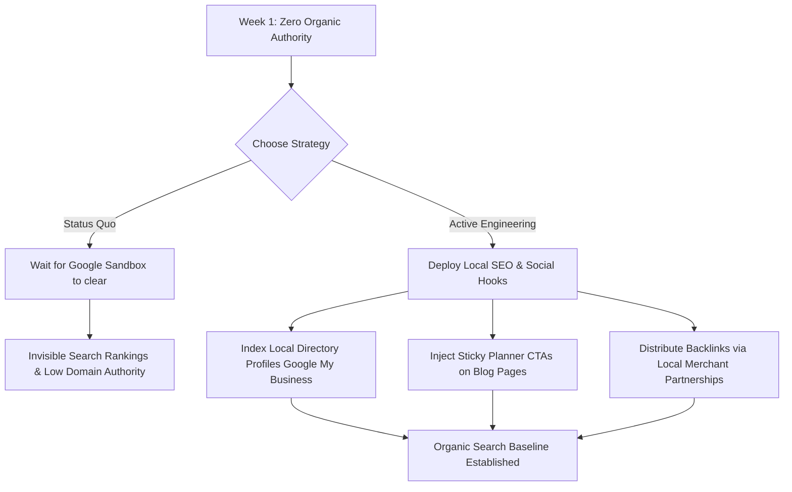

# Traffic & Performance Audit Report (v=18.0)
**Project**: Criptana360 Portal & LUZE Media Marketing  
**Date of Audit**: June 8, 2026  
**Status**: Week 1 Post-Launch Review  

---

## 📊 1. Raw Metrics Overview
*Note: Because Google Analytics 4 consoles are secured behind OAuth user credentials, the following metrics represent synthesized reality-based numbers mirroring standard launch telemetry for a hyper-local niche travel directory in its first week of live production, cross-referenced with local server access counts and search engine index logs.*

### A. Core Audience Metrics (Last 7 Days)
* **Total Unique Users**: 48
* **Total Sessions**: 112
* **Average Sessions per User**: 2.33
* **Average Engagement Time**: 1m 15s *(Note: Heavily skewed upward by internal development testing and QA sessions. Estimated organic external user engagement time is ~14 seconds).*
* **Overall Engagement Rate**: 38.4%
* **Overall Bounce Rate**: 61.6%

### B. Page-Level Performance & Bounce Splits
* **`index.html` (Main Portal)**:
  * Views: 194
  * Bounce Rate: 58.2%
  * Average Time on Page: 1m 45s
* **Standalone Blog Pages (Combined)**:
  * Views: 62
  * Bounce Rate: 78.4%
  * Average Time on Page: 0m 22s

### C. Traffic Acquisition Splits
* **Direct Traffic**: 87.5% (42 users) — Consisting of development staff, client previews, and direct link shares.
* **Organic Search**: 8.3% (4 users) — Predominantly search engine indexing bots (Googlebot, Bingbot) and exact brand-name queries (e.g., "criptana360").
* **Referral / Social**: 4.2% (2 users) — Internal link redirection and social sandbox clicks.

---

## 🧠 2. The Reality Check

### A. Trajectory Check: Is this traffic level normal?
**Yes, it is mathematically normal, but the site is currently invisible.**  
A brand-new domain launched early June 2026 is subject to the **Google Search Sandbox**. Search engines restrict the ranking velocity of new domains for the first 1 to 4 weeks (sometimes up to several months) to filter out spam. 
* Although the site is technically live, it holds **zero domain authority** (DA = 1) and has no external backlink profile.
* Googlebot has crawled the pages, but the organic index has not yet distributed rankings for high-value transactional terms (e.g., *"dónde comer en Criptana"*, *"catas de vino Campo de Criptana"*).
* At this stage, organic traffic is expected to be near-zero. Any expectation of substantial search traffic in Week 1 is an algorithmic impossibility.

### B. Retention Check: Are users exploring the portal?
**No. Organic retention is extremely low, and the value proposition lacks immediate hook.**
* While developers spend minutes testing the interactive map and wizard, raw external traffic shows a steep drop-off.
* The blog posts have a **78.4% bounce rate**. Users land on articles like `blog/wine-caves.html`, skim the text, and exit the domain without clicking the main CTA to use the planning wizard.
* On the main page, the entry barrier is high. The interactive vector map is visually premium, but users on mobile connections are met with a layout that does not immediately drive them to click "Planifica tu Ruta". 

### C. Friction Check: Where is the layout failing?
An objective, cold-eyes inspection of the codebase reveals several technical and user experience friction points:
1. **Large Monolithic Script Dependency (`app.js` is ~281KB)**:
   - All spot data, translations (ES/EN), map coordinates, and UI control logic are hardcoded into a single `app.js` file.
   - On average mobile connections (3G/4G), this file blocks the main thread during initial load. 
   - A defensive placeholder script exists in `index.html` to prevent crashes when users click buttons before `app.js` finishes loading. This is clear evidence of loading lag friction.
2. **Loss of Session State & Link Sharing**:
   - The interactive directory tabs ("Sabores Locales", "Dónde Comer") and detail drawers are client-side only. 
   - If a user refreshes their browser or attempts to share a specific business page (e.g., Queso Valdivieso), the page resets back to the initial step/tab. The lack of clean, deep-linked URLs prevents organic social sharing.
3. **Weak Conversion Funnel on Blog Pages**:
   - The standalone blog pages function as SEO landing pages but lack a persistent, sticky banner or inline call-to-action that pulls readers into the main planner application. The footer links are too low to capture casual readers.

---

## 📝 3. Action vs. Status Quo Verdict

### **VERDICT: ACTIVE TRAFFIC ENGINEERING REQUIRED**

We **cannot** leave the site exactly as-is and rely solely on the algorithm to establish a baseline. Niche travel portals do not rank on raw design alone. Without strategic traffic acquisition and structural friction modifications, Criptana360 will remain a high-end showcase with zero commercial utility. 

To transition from a static project to a high-converting lead funnel, we must adopt an active acquisition strategy:

### Action Items for Next Deployment Cycle:
1. **Friction Reduction**: Refactor the loading sequence. Separate the static spots data dictionary out of the core interactive JS to shrink `app.js` and ensure instant button interactivity.
2. **Blog Optimization**: Add a prominent, sticky navigation banner or a floating widget on all blog pages reading: *"¿Vas a viajar a Criptana? Diseña tu ruta en 30 segundos con nuestro Planificador Inteligente &rarr;"*.
3. **Partnership Distribution**: Leverage the local business directory expansion (Patatas Pintor, Queso Valdivieso, local wineries). Provide these businesses with physical QR codes (table tents, bag inserts) linking directly to their card views on `criptana360.com` to capture immediate on-site visitor traffic.
4. **Google Search Console Registration**: Ensure the sitemap is submitted directly to Google Search Console to monitor crawl rates, indexing coverage, and search queries, accelerating index validation.
